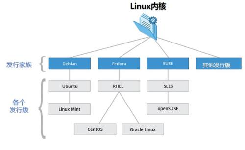
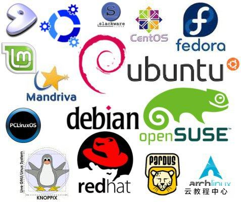

# Linux-00Linux概述

    last modified: 2020-07-13 

> ## 为什么要学习Linux

在开发领域linux越来越受欢迎，所有的Java岗位都需要掌握对Linux的基本使用,尤其是作为一个后端程序员,是必须要掌握Linux的,同时很多大型Java项目都是部署在Linux上的.

> ## Linux简介

Linux 内核最初只是由芬兰人林纳斯·托瓦兹（Linus Torvalds）在赫尔辛基大学上学时出于个人爱好而编写的。

Linux 是一套免费使用和自由传播的类 Unix 操作系统，是一个基于 POSIX（可移植操作系统接口） 和 UNIX 的多用户(root,子用户...)、多任务、支持多线程和多 CPU 的操作系统。

Linux 能运行主要的 UNIX 工具软件、应用程序和网络协议。它支持 32 位和 64 位硬件。Linux 继承了 Unix 以网络为核心的设计思想，是一个性能稳定的多用户网络操作系统。

> ## Linux发行版

Linux 的发行版说简单点就是将 Linux 内核与应用软件做一个打包."内核+软件+工具+可完全安装程序"

从Linux Kernel 3.0 开始已经舍弃奇数,偶数的内核版本规划,新的规划使用主线版本(MainLine)为依据,并提供长期支持版本来加强某些功能的持续维护.

目前市面上较知名的发行版有：Ubuntu,RedHat,CentOS,Debian,Fedora,SuSE,OpenSUSE,Arch Linux,SolusOS 等.

> ## Linux应用领域

今天各种场合都有使用各种 Linux 发行版,从嵌入式设备到超级计算机,并且在服务器领域确定了地位,通常服务器使用 LAMP（Linux + Apache + MySQL + PHP）或 LNMP（Linux + Nginx+ MySQL + PHP）组合.

> ## Linux和Windows比较

| 比较 | Windows | Linux |
| :------ | :------| :------|
| 界面 | 界面统一,外壳程序固定,所有Windows程序彩蛋几乎以制,快捷键也几乎相同 | 图形界面风格依据发布版不同而不同,可能互不兼容.GUI/Linux的终端机是从UNIX传承下来,基本命令和操作方法也几乎一致 |
| 驱动程序 | 驱动程序丰富,版本更新频繁.默认安装程序里面一般包含有该版本发布时流行的硬件驱动程序,之后所出的新硬件去东莞依赖于硬件厂商提供.对于一些老硬件,如果没有了原配的驱动,有时很难启动,有时很难支持.另外,有时硬件厂商未提供所需版本下的Windows下的驱动 | 由志愿者开发,由Linux核心开发小组发布,很多硬件厂商基于版权考虑并未提供驱动程序,尽管多数无需手动安装,但是设计安装方法则相对复杂,使得新用户面对驱动问题会比较麻烦,但在开源开发模式下,许多老硬件尽管在Windows下很难支持的也容易找到驱动,很多硬件厂商在逐步不同程度地支持开源,问题正在得到缓解 |
| 使用 | 使用比较简单,容易入门.图形化界面对没有计算机背景知识的用户使用十分便利 | 图形界面使用简单,容易入门.文字界面需要学习才能掌握 |
| 学习 | 系统构造复杂,变化纷繁,且知识,技能淘汰快,深入学习困难 | 系统构造简单稳定,且知识,技能传承性好,深入学习相对容易 |
| 软件 | 每一种特定功能可能都需要商业软件的支持,需要购买相应的授权 | 大部分软件都可以自由获取,同样功能的软件选择较少 |

> ## 如何学习Linux基础

1. 计算机概论与硬件相关知识

    因为既然想要走Linux这条路,信息技术相关的基础技能不能没有,所以先理解一下基础的硬件知识,不一定要全懂,

2. 先从Linux的安装与命令学起

    没有Linux怎么学习Linux?所以好好地安装一个你需要的Linux. 虽然说Linux的发行版很多,不过架构上都是大同小异,差别在于界面的亲和力与软件的选择不同罢了.

3. Linux操作系统的基础技能

    这些包含了"用户,用户组的概念","权限的感念","程序的定义"等,尤其是权限的概念,由于不同的权限的设置会影响你使用的用户的便利性,但是太过于便利又会导致入侵的可能,所以这里需要了解一下你的系统.

4. 务必学会vi文本编辑器

    Linux的文本编辑器多到会让你数到生气,不过,vi是强烈建议要先学习的,这是因为vi会被很多软件所调用,加上所有的UNIX-like的系统上都有vi,所以一定要学会才好.

5. Shell和Shell脚本的学习

    既然要玩命令行模式,当然就要学会使用Shell.但是Shell上面的知识太多了,包括"正则表达式","管道命令",与"数据流重定向"等,真的需要了解比价好.此外为了帮助你未来管理服务器的便利性,Shell脚本很重要

6. 一定要学会软件管理

    因为玩Linux常常会面临到要自己安装驱动程序或安装额外软件的时候,尤其是嵌入式设备或学术研究单位.这个时候要了解Tarball,RPM,DPKG,YUM,APT等软件管理的安装方式

7. 网络基础的建立

    网络基础包括"IP概念","路由概念"等
