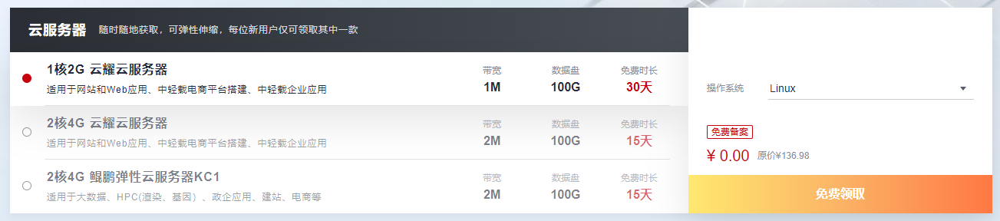
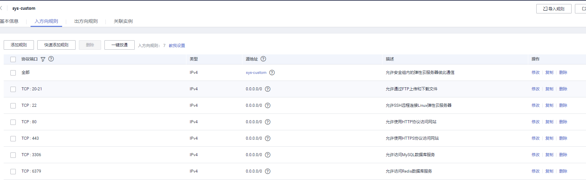
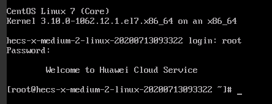
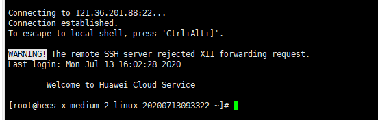
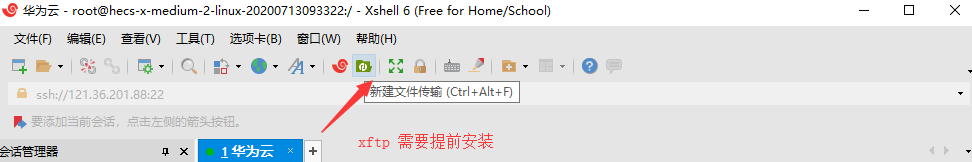
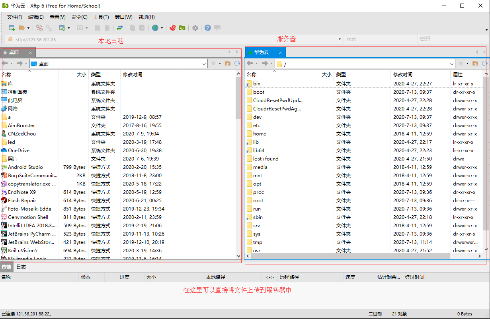

# Linux-01环境配置

    last modified:2020-07-13

> ## Linux 服务器购买

Linux的安装步骤比较繁琐,推荐使用云服务器,建议使用华为云,可以免费试用,每天早上9：30开抢.

1. 购买服务器,链接:<https://activity.huaweicloud.com/free_test/index.html?ggw_hd#individual>

2. 购买完毕之后,获取服务器的ip,重置服务器密码,就可以远程登录

3. 可以自定义设置华为云的安全组,添加需要开放的端口,否则外界无法访问.

    

4. 使用xShell工具(使用xShell必须开放22端口)进行远程连接,或者使用华为云的网页远程登陆.

    网页远程登录 

    xShell远程登录 

> ## xShell相关信息

- Ctrl + 鼠标滚轮 => 放大/缩小字体

- 使用xftp上传文件

  - 

  - 