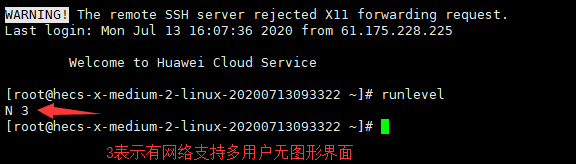

# Linux-02启动流程

    last modified:2020-07-13

> ## Linux启动流程(了解)

- 加载BIOS(Basic Input Output System):BIOS是系统启动时加载的第一个软件

  - 启动上电自检POST(Power-On-Self-Test),负责完成对CPU,主板,内存,软硬盘子系统,显示子系统(包括显示缓存),串并行接口,键盘,CD-ROM光驱等的检测,主要检查硬件的好坏
  
  - 对外部设备进行初始化,读取BIOS参数,并和实际的硬件进行比较,如果不符合,会影响系统启动

  - 查找MBR(Master Boot Record,主引导分区),如果未找到,会提示找不到硬盘

- 读取主引导分区(MBR):拷贝启动引导代码BootLoader

- 启动引导代码(BootLoader):当我们硬盘上有多个操作系统的时候,可以用来选择进入到哪一个操作系统

- 加载内核,进入操作系统:运行第一个程序:/sbin/init

  - sbin/init 会读取相关的配置文件,来确定系统的运行级别:

    - 0 : 关机

    - 1 : 单用户模式

    - 2 : 无网络支持的多用户模式

    - 3 : 有网络支持的多用户模式

    - 4 : 保留,未使用

    - 5 : 有网络支持,且有图形化界面的多用户模式

    - 6 : 重启

    - 切换运行级别 : init 级别

    

- 根据对应的运行级别,查找对应的脚本文件.例如,运行3级别,查找/etc/rc3.d目录,启动该目录下的相关服务
  - 这些文件夹下的init脚本都有一些特别的名字,命名都以S(start),K(kill)或D(disable)开头,后面跟一个数字.当init进入一个运行等级的时候,他会按照数字顺序运行所有以K开头的脚本并传入stop参数,除非对应的init脚本在前一个运行等级中没有启动.然后init按照数字吮吸运行所有以S开头的脚本并传入start参数.任何以D开头的init脚本都会被忽略.这让你可以在指定的运行等级禁止一个脚本,或者你也可以仅仅移除全部符号链接.

  - 解析用户自定义的启动脚本:/etc/rc.local(如果存在的话)

  - 进入用户界面

> ## Linux 关机

在Linux领域内大多用在服务器上,很少遇到关机的操作.毕竟在服务器上跑一个服务是永无止境的,除非特殊情况下,不得已才关机.

关机指令为: shutdown.最后总结一下,不管是重启系统还是关闭系统,首先要运行 sync 命令,把内存中的数据写到磁盘中.

```shell
sync # 将数据由内存同步到硬盘中。

shutdown # 关机指令，你可以man shutdown 来看一下帮助文档。例如你可以运行如下命令关机：

shutdown –h 10 # 这个命令告诉大家，计算机将在10分钟后关机

shutdown –h now # 立马关机

shutdown –h 20:25 # 系统会在今天20:25关机

shutdown –h +10 # 十分钟后关机

shutdown –r now # 系统立马重启

shutdown –r +10 # 系统十分钟后重启

reboot # 就是重启，等同于 shutdown –r now

halt # 关闭系统，等同于shutdown –h now 和 poweroff
```