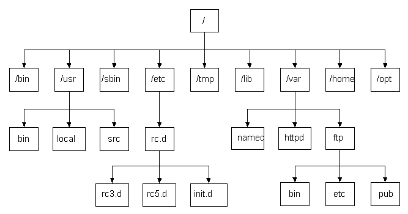

# Linux的目录、文件与磁盘格式

## 2.1 Linux系统目录结构

    last modified：2020-07-15

> ### 2.1.1 文件系统介绍

操作系统中，用来管理和存储文件信息的软件机构成为文件管理系统，简称文件系统。简单来说，这部分系统就是负责用户建立、读取、修改和转储文件，控制文件的存取，当用户不再使用时撤销文件。

> ### 2.1.2 常见的文件系统介绍

- FAT 16

    MS-DOS6.X及以下版本使用。每个磁盘的分区最大只能达到2G，并且会浪费很多空间。在FAT16里有簇的概念，相当于是图书馆里一格一格的书架，每个要存到磁盘的文件都必须配置足够数量的簇，才能存放到磁盘中，每个文件无论大小，都至少要使用一个簇在保存。

    FAT16 各分区与簇大小的关系如下表：

    | 分区大小 | FAT16簇大小 |
    | :------ | :------ |
    | 16MB - 127MB | 2KB |
    | 128MB - 255MB | 4KB |
    | 256MB - 511MB | 8KB |
    | 512MB - 1023MB | 16KB |
    1024MB - 2047MB | 32KB |

- FAT 32

    Windows95以后的系统都支持。

    FAT32具有一个最大的优点：在一个不超过8GB的分区中，FAT32分区格式的每个簇容量都固定为4KB，与FAT16相比，可以大大地减少磁盘的浪费，提高磁盘利用率。

    突破了FAT16对每一个分区的容量只有2GB的限制，可以将一整个大硬盘定义成一个分区而不必分为几个分区使用，方便了对磁盘的管理。但是FAT32里，无法存放大于4GB的单个文件，而且容易产生磁盘碎片，性能不佳。

    另外，FAT不支持长文件名，只能支持8个字符，而且后缀名最大只支持3个字符。

- NTFS 

    WindowsNT系列设计，用来取代FAT系统。每个簇的空间更小，磁盘利用率越高，并且可以共享资源、文件夹以及对文件设置访问许可权限。

- RAW 

    RAW文件系统是一种磁盘未经处理或未格式化产生的文件系统。一般来说有这几种可能造成正常文件系统变成RAW文件系统：

  - 没有格式化

  - 格式化中途取消

  - 硬盘出现坏道

  - 硬盘出现不可预知的错误

- EXT 

    EXT是扩展文件系统

- HFS(+) 

    HFS是苹果电脑上的文件系统

> ### 2.1.3 Linux文件系统

不同于Windows系统有盘符的概念（C盘、D盘），Linux里只有一个盼复，是从'/'开始的，只有它是没有上级目录的。如果把整个应用目录系统看成一个树形结构，'/'相当于这个树形结构的根，我们可以将'/'称之为根目录。

在Linux中一切皆文件。



登陆系统之后，在命令行中输入以下命令

``` shell
ls /
```


**对目录的解释：**

- **/bin**：bin是Binary的缩写, 这个目录存放着最经常使用的命令，包含了一些二进制文件，即可执行文件。我们在命令行里执行的指令，例如ls，rm，cp，mv等，其实都是执行的这个目录里的二进制文件。

- **/boot**： 这里存放的是启动Linux时使用的一些核心文件，包括一些连接文件以及镜像文件。（勿动）

- **/dev** ： dev是Device(设备)的缩写, 其中许多都是在启动时或运行时生成的，存放的是Linux的外部设备，在Linux中访问设备的方式和访问文件的方式是相同的。

- **/etc**： 这个目录用来存放所有的系统管理所需要的配置文件和子目录。（会经常使用）

- **/home**：用户的主目录，在Linux中，每个用户都有一个自己的目录，一般该目录名是以用户的账号命名的，所有的用户都存放在home目录下。

- **/lib**：这个目录里存放着系统最基本的动态连接共享库，其作用类似于Windows里的DLL文件。

- **/lost+found*8：这个目录一般情况下是空的，当系统非法关机后，这里就存放了一些没来得及保存的文件。

- **/media：linux**:系统会自动识别一些设备，例如U盘、光驱等等，当识别后，linux会把识别的设备挂载到这个目录下。

- **/mnt**：系统提供该目录是为了让用户临时挂载别的文件系统的，我们可以将光驱挂载在/mnt/上，然后进入该目录就可以查看光驱里的内容了。(后面会把一些本地的文件挂载在这个目录上)

- **/opt**：这是给主机额外安装软件所摆放的目录。比如你安装一个ORACLE数据库则就可以放到这个目录下。默认是空的。

- **/proc**：这个目录是一个虚拟的目录，它是系统内存的映射，我们可以通过直接访问这个目录来获取系统信息。

- **/root**：该目录为系统管理员，也称作超级权限者的用户主目录。

- **/sbin**：s就是Super User的意思，这里存放的是系统管理员使用的系统管理程序。

- **/srv**：该目录存放一些服务启动之后需要提取的数据。

- **/sys**：这是linux2.6内核的一个很大的变化。该目录下安装了2.6内核中新出现的一个文件系统 sysfs 。

- **/tmp**：这个目录是用来存放一些临时文件的，用完就丢的文件可以放在这个目录。

- **/usr**：这是一个非常重要的目录，用户的很多应用程序和文件都放在这个目录下，类似于windows下的program files目录。

- **/usr/bin**： 系统用户使用的应用程序。

- **/usr/sbin**： 超级用户使用的比较高级的管理程序和系统守护程序。

- **/usr/src**： 内核源代码默认的放置目录。

- **/var**：这个目录中存放着在不断扩充着的东西，我们习惯将那些经常被修改的目录放在这个目录下。包括各种日志文件。

- **/run**：是一个临时文件系统，存储系统启动以来的信息。当系统重启时，这个目录下的文件应该被删掉或清除。

- **www**: 服务器相关目录，存放服务器网站相关资源，环境，网站的项目等。

## 2.2 目录相关命令