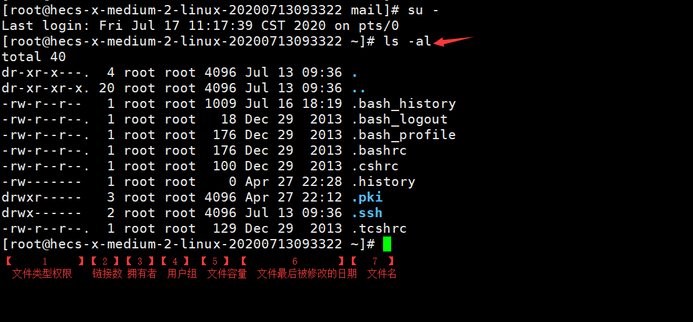
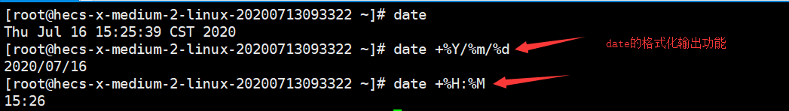

# Linux的目录、文件与磁盘格式

## 2.1 Linux系统目录结构

    last modified：2020-07-15

> ### 2.1.1 文件系统介绍

操作系统中，用来管理和存储文件信息的软件机构成为文件管理系统，简称文件系统。简单来说，这部分系统就是负责用户建立、读取、修改和转储文件，控制文件的存取，当用户不再使用时撤销文件。

> ### 2.1.2 常见的文件系统介绍

- FAT 16

    MS-DOS6.X及以下版本使用。每个磁盘的分区最大只能达到2G，并且会浪费很多空间。在FAT16里有簇的概念，相当于是图书馆里一格一格的书架，每个要存到磁盘的文件都必须配置足够数量的簇，才能存放到磁盘中，每个文件无论大小，都至少要使用一个簇在保存。

    FAT16 各分区与簇大小的关系如下表：

    | 分区大小 | FAT16簇大小 |
    | :------ | :------ |
    | 16MB - 127MB | 2KB |
    | 128MB - 255MB | 4KB |
    | 256MB - 511MB | 8KB |
    | 512MB - 1023MB | 16KB |
    1024MB - 2047MB | 32KB |

- FAT 32

    Windows95以后的系统都支持。

    FAT32具有一个最大的优点：在一个不超过8GB的分区中，FAT32分区格式的每个簇容量都固定为4KB，与FAT16相比，可以大大地减少磁盘的浪费，提高磁盘利用率。

    突破了FAT16对每一个分区的容量只有2GB的限制，可以将一整个大硬盘定义成一个分区而不必分为几个分区使用，方便了对磁盘的管理。但是FAT32里，无法存放大于4GB的单个文件，而且容易产生磁盘碎片，性能不佳。

    另外，FAT不支持长文件名，只能支持8个字符，而且后缀名最大只支持3个字符。

- NTFS 

    WindowsNT系列设计，用来取代FAT系统。每个簇的空间更小，磁盘利用率越高，并且可以共享资源、文件夹以及对文件设置访问许可权限。

- RAW 

    RAW文件系统是一种磁盘未经处理或未格式化产生的文件系统。一般来说有这几种可能造成正常文件系统变成RAW文件系统：

  - 没有格式化

  - 格式化中途取消

  - 硬盘出现坏道

  - 硬盘出现不可预知的错误

- EXT 

    EXT是扩展文件系统

- HFS(+) 

    HFS是苹果电脑上的文件系统

> ### 2.1.3 Linux文件系统

不同于Windows系统有盘符的概念（C盘、D盘），Linux里只有一个盼复，是从'/'开始的，只有它是没有上级目录的。如果把整个应用目录系统看成一个树形结构，'/'相当于这个树形结构的根，我们可以将'/'称之为根目录。

'/'根目录是整个系统最重要的一个目录,但不是所有的目录都是由根目录衍生出来的,同时根目录也与启动、还原、系统修复等操作有关.

在Linux中一切皆文件。


登陆系统之后，在命令行中输入以下命令

``` shell
ls /
```


**对目录树的解释：**

- **/bin**：bin是Binary的缩写, 这个目录存放着最经常使用的命令，包含了一些二进制文件，即可执行文件。我们在命令行里执行的指令，例如ls，rm，cp，mv等，其实都是执行的这个目录里的二进制文件。/bin放置的是单人维护模式下还能够被使用的命令,在/bin下面的命令可以被root与一般账号所使用.

- **/boot**： 这里存放的是启动Linux时使用的一些核心文件，包括一些连接文件以及镜像文件。Linux的内核常用文件名为:vmlinuz,如果使用的是grub2这个启动引导程序,则还会存在/boot/grub2这个目录.（勿动）

- **/dev** ： dev是Device(设备)的缩写, 其中许多都是在启动时或运行时生成的，存放的是Linux的外部设备，在Linux中访问设备的方式和访问文件的方式是相同的。你只要通过读写这个目录下面的某个文件,就等于读写某个设备,比较重要的文件有/dev/null,/dev/zero,/dev/tty,/dev/loop*,/dev/sd*等.

- **/etc**： 这个目录用来存放所有的系统管理所需要的配置文件和子目录。（会经常使用）

- **/home**：用户的主目录，在Linux中，每个用户都有一个自己的目录，一般该目录名是以用户的账号命名的，所有的用户都存放在home目录下。

- **/lib**：这个目录里存放着系统最基本的动态连接共享库，其作用类似于Windows里的DLL文件。

- **/lost+found**：这个目录一般情况下是空的，当系统非法关机后，这里就存放了一些没来得及保存的文件。

- **/media**：linux系统会自动识别一些设备，例如U盘、光驱等等，当识别后，linux会把识别的设备挂载到这个目录下。

- **/mnt**：系统提供该目录是为了让用户临时挂载别的文件系统的，我们可以将光驱挂载在/mnt/上，然后进入该目录就可以查看光驱里的内容了。(后面会把一些本地的文件挂载在这个目录上)

- **/opt**：这是给主机额外安装软件所摆放的目录。比如你安装一个ORACLE数据库则就可以放到这个目录下。默认是空的。

- **/proc**：这个目录是一个虚拟的目录，它是系统内存的映射，我们可以通过直接访问这个目录来获取系统信息。

- **/root**：该目录为系统管理员，也称作超级权限者的用户主目录。

- **/sbin**：s就是Super User的意思，这里存放的是系统管理员使用的系统管理程序。放在/sbin下面的为启动过程中所需要的,里面包括了启动、修复、还原系统所需要的命令.常见的命令包括:fdisk,fsck,ifconfig,mkfs等.

- **/srv**：该目录存放一些服务启动之后需要提取的数据。

- **/sys**：这是linux2.6内核的一个很大的变化。该目录下安装了2.6内核中新出现的一个文件系统 sysfs 。

- **/tmp**：这个目录是用来存放一些临时文件的，用完就丢的文件可以放在这个目录。

- **/usr**：这是一个非常重要的目录，用户的很多应用程序和文件都放在这个目录下，类似于windows下的program files目录。

- **/usr/bin**： 系统用户使用的应用程序,一般用户能够使用的命令都发放在这里面.

- **/usr/sbin**： 超级用户使用的比较高级的管理程序和系统守护程序。

- **/usr/src**： 内核源代码默认的放置目录。

- **/var**：这个目录中存放着在不断扩充着的东西，我们习惯将那些经常被修改的目录放在这个目录下。包括各种日志文件。

- **/run**：是一个临时文件系统，存储系统启动以来的信息。当系统重启时，这个目录下的文件应该被删掉或清除。

- **www**: 服务器相关目录，存放服务器网站相关资源，环境，网站的项目等。

**文件系统与目录树的关系（挂载）:**

所谓的“挂载”就是利用一个目录当成进入点，将磁盘分区的数据放置在该目录下；也就是说进入该目录就可以读取该分区的意思。

比较特殊的目录：

    . 代表此层目录

    .. 代表上一层目录

    - 代表前一个工作目录

    ~ 代表目前使用者身份所在的家目录

    ~account 代表account这个使用者的家目录（account是个账号名称）

---

## 2.2 Linux文件权限

    last modified：2020-07-17

> ### 2.2.1 Linux文件属性

要了解Linux的文件属性，ls这个查看文件的命令很重要。ls是list的意思，用于显示文件的文件名和相关属性，-al 选项表示列出所有文件的详细的权限和属性（包含隐藏文件，隐藏文件是指第一个字符为. 的文件）

```bash
su -
ls -al
```



1. 文件的类型与权限：例如[-rwxrwx---]

    - 第一个字符代表这个文件是目录、文件或链接文件等

      - d: 目录

      - -：文件

      - |：链接文件

      - b：设备文件里面可供存储的周边设备

      - c：表示设备文件里面的串行端口设备

    - 接下来的字符中，三个为一组，且均为[rwx]的三个参数的组合。
    
      - r：可读

      - w：可写

      - x：可执行

    - 第一组为文件拥有者可具备的权限

    - 第二组为加入此用户组的账号的权限

    - 第三组为非本人且没有加入本用户组的其他账号的权限

    

2. 文件名连接到此节点的数量

3. 这个文件（或目录）的拥有者

4. 这个文件所属的用户组

5. 这个文件的容量大小，默认单位为bytes

    如果这个文件被修改的时间距离现在太久，那么仅显示年份。

6. 此文件的文件名

    文件名前多一个. 则表示这个文件是隐藏文件。

- 例子： -rw-r--r-- 1 root root 238 Jun 18 17:22 test.txt

  - 文件test.txt的拥有者是root，用户组是root，只有root这个账号可以读写，其他人只能读这个文件

- 例子： drwxr-xr-- 1 test1 testgroup 5238 Jun 19 10 ：25 groups/

  - 文件拥有者test1 rwx，可以在本目录中进行任何工作

  - testgroup r-x，这个用户组可以进入本目录进行工作但是不能在本目录下进行写入操作

  - 其他用户 r--，虽然有r，但是由于没有x的权限，因此other用户不能进入此目录

> ### 2.2.2 Linux文件的权限意义

- 权限对文件的重要性

  - r: 可读取此文件的实际内容

  - w: 可以编辑、新增或是修改文件的内容，但不具备删除该文件本身的权限

  - x: 该文件具有可以被系统执行的权限

  在Linux下文件是否能被执行，由是否具有x的权限来决定

- 权限对目录的重要性

  - r: 表示具有读取目录结构列表的权限

  - w: 表示具有改动该目录结构列表的权限

    - 建立新的文件与目录

    - 删除已经存在的文件与目录（不论该文件的权限是什么）

    - 将已存在的文件或目录进行改名

    - 移动该文件内的文件、目录位置

  - x: 代表用户能否进入该目录成为工作目录的用途。当用户在某目录下不具有x的权限，那么就无法切换到该目录下，也就无法执行该目录下的任何命令，即使具有该目录的rw权限。

> ### 2.2.3 文件种类

任何设备在Linux下都是文件

- 文件种类：

  - 常规文件：

    第一个字符为 -

    - 纯文本文件(ASCII)

    - 二进制文件(binary)

    - 数据文件(data)
  
  - 目录：

    第一个字符为 d

  - 链接文件：

    类似于Windows系统下面的快捷方式，第一个属性为l(L的小写)

  - 设备与设备文件：

    - 区块(block)设备文件：第一个属性为b，一些存储数据，以提供系统随机存取的结构设备

    - 字符(character)设备文件：第一个属性为c，串行端口设备

  - 数据接口文件(sockets)
    
    第一个属性为s

  - 数据传送文件(FIFO,pipe)

    第一个属性为p，主要用于解决多个程序同时读写一个文件所造成的错误问题

- Linux 扩展名:

    在Linux中只要权限当中有x，就代表这个文件有可以被执行的能力，通常会用合适的扩展名来表示该文件是什么种类

  - *.sh: 脚本或批处理文件

  - *.tar , *.tar.gz , *.zip , *.tgz: 经过打包的压缩文件，根据不同的压缩软件取相关的扩展名

  - *.html *.php: 网页相关文件，分别代表html，php语法的网页文件。

- Linux文件名的限制:

  - 长度限制: 单一文件或目录的最大容许文件名为255字节，以一个ASCII英文占用1字节来说，则大约可达255个字符长度；若以每个汉字占用2字节来说，最大文件名大约在128个汉字之间

  - 避免一些特殊字符：* ? > < ; & [ ] | \ ' " ` ( ) { }

> ### 2.2.4 修改文件属性和权限

Linux文件权限最大的用途在于数据安全性。

用于用户组、拥有者、各种身份的权限修改的命令

- **chgrp**: 修改文件所属用户组
  
    要被修改的组名必须要在/etc/group文件中存在才行。

    ```bash
    chgrp [-R] 文件或目录 ...
    # 参数与选项
    # [-R]: 进行递归修改，连同子目录下的所有文件、目录都更新成为这个新用户组，常常用来修改某一目录内的所有文件的情况
    ```

- **chown**: 修改文件拥有者

    用户必须是已经存在系统中的账号，即在/etc/passwd 这个文件中有记录的用户名称才能修改
  
    ```bash
    chown [-R] 账号名称 文件或目录
    chown [-R] 账号名称:用户组名称 文件或目录
    # 参数与选项
    # [-R]: 进行递归修改，连同子目录下的所有文件都修改
    ```

- **chmod**: 修改文件的权限
  
  文件权限的设置有两种方法，数字法或符号法

  - 数字类型修改文件权限

    Linux文件的基本类型就有9个，分别是owner，group，other三种身份分子的read，write，execute权限。

    例如，-rwxrwx---

    - owner: rwx 4+2+1 = 7

    - group: rwx 4+2+1 = 7

    - other: --- 0+0+0 = 0
      
    所以设置权限时的数字就是770

    ```bash
    chmod [-R] xyz 文件或目录
    # 参数与选项
    # [-R]: 进行递归修改，连同子目录下的所有文件都修改
    # xyz: 上文所提到的数字类型的权限属性，即rwx的所代表的数值
    # 例如要把.bashrc这个文件的所用权限都设置启用
    chmod 777 .bashrc
    ```

  - 符号类型修改文件权限

    - u: user，使用者

    - g: group，用户组

    - o: other，其他人

    - a: all,表示全部的身份

    - +: 加入

    - -: 移除

    - =: 设置

    ```bash
    # 例如设置[-rwxr-xr--]的权限
    chmod u=rwx,g=rx,o=r filename
    # u=rwx,g=rx,o=r 中间无空格
    # 例如增加.bashrc 每个人都可以写入的权限
    chmod a+w .bashrc
    ```

---

## 2.3 Linux简单命令学习

    last modified:2020-07-16

在学习文件系统相关操作命令前,来学习简单的基础命令操作

> ### 2.3.1 命令行模式下的执行

``` shell
$ command [-options] parameter1 parameter2
命令    选项        参数1      参数2
```

上述命令详细说明：

1. 一行命令中第一个输入的部分绝对是命令（command）或可执行文件（例如shell脚本）

2. command 为命令的名称，例如变换工作目录的命令为cd等

3. 中括号[]并不存在实际的命令中，表示是可选的，而加入选项设置时，通常选项前会带 - 号，例如 -h；有时候会使用选项的完整全名，则选项前带有 -- 号，例如 --help

4. parameter1 parameter2 都是依附在选项后面的参数,或者是command的参数

5. 命令、选项、参数等这几个东西中间以空格来区分，不论空几格shell都视为空一格

6. 按下回车键后，该命令就立即执行，回车键代表着一行命令的开始启动

7. 命令太长的时候，可以使用反斜杠(\)来转义回车键，使命令连续到下一行，注意，反斜杠后立刻接其他特殊字符才能转义

8. 在Linux系统中,英文大小写字母是不一样的,cd 和 CD 是不一样的

9. 更多的介绍在后续"认识与学习BASH"再来详述

> ### 2.3.2 基础命令的操作

- 显示日期与时间的命令: **date**

```bash
date
date +%Y/%m/%d
date +%H:%M
```


- 显示日历的命令: **cal**

```bash
cal [month] [year]
cal # 列出这个月的日历-直接cal
cal 2015 # 列出某一年的日历
cal 10 2020 #列出2020年10月的日历
cal 13 2020 # 2020有没有13月
```


某些命令有特殊的参数存在,如果输入错误的参数,该命令会有错误信息的提示,通过这个提示我们可以了解命令执行的错误之处


- 简单好用的计算器: **bc**

```bash
bc # 输入bc就可以进入到bc的工作环境中了
+ # 加法
- # 减法
* # 乘法
/ # 除法
^ # 指数
% # 余数
scale=number # 设置bc输出的小数点后位数,number为要输出的位数
quit # 离开bc
```


从上面的简单命令中我们可以知道在命令行模式里执行命令时,会有两种主要的情况:

- 一种是该命令会直接显示结果,然后回到命令提示字符等待下一个命令的输入.

- 一种是进入到该命令的环境,直到结束该命令才回到命令行界面的环境.

> ### 2.3.3 重要的热键

- [tab]按键

    tab具有命令补全和文件补全的功能.
  - [tab]接在一串命令的第一个字段后面,则为**命令补全**

  - [tab]接在一串命令的第二个字段后面,则为**文件补全**

    ```bash
    ca [tab] [tab] # 这里的[tab] [tab] 是指连续按下两次tab按键
    ```

    

- [Ctrl]+c 按键

    [Ctrl]+c是组合按键,用来中断目前程序的按键

- [Ctrl]+d 按键

    [Ctrl]+d组合代表着键盘输入结束(End of File)的意思.另外,它也可以取代exit的输入.

- [Shift]+{[Page Up]|[Page Down]}

    这个组合按键是用来向前/向后翻页查看输出的信息.

> ### 2.3.4 错误信息的查看

如果执行了错误的命令,可以借由屏幕上显示的错误信息来了解你的问题.

```bash
DATE
```


通常造成[command not found]的可能原因为:

- 这个命令不存在,因为这个软件没有安装,解决方法是安装这个软件

- 这个命令所在的目录目前的用户并没有将它加入命令查找路径

- 打错字了

---