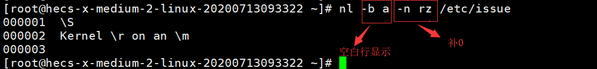
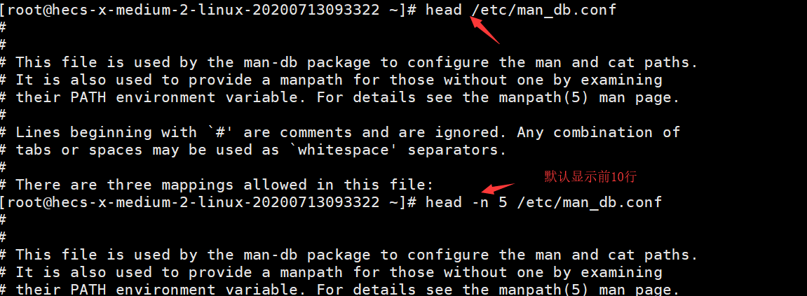

# Linux文件目录管理

## 3.1 Linux目录与路径

    last modified:2020-07-17

在开始目录的切换之前,首先要了解一下所谓的"路径"(PATH)

> ### 3.1.1 相对路径和绝对路径

- . : 代表当前目录,也可以使用./来表示

- .. : 代表上一层目录,也可以使用 ../来表示 

- 绝对路径 : 由根目录(/)开始邪气的文件名或目录名称,例如/home/dmtsai/.bashrc

    绝对路径的正确度比较好。建议在写shell脚本来管理系统的条件下，使用绝对路径.

- 相对路径 : 相对于当前路径的文件名写法,例如./home/dmtsai

    相对路径更加方便和简洁.

例如,先进入/var/spool/mail/目录,再进入到/var/spool/cron/目录

```bash
cd /var/spool/mail/
cd ../cron
``` 

> ### 3.1.2 目录的相关操作

常见的处理目录的命令：

- **cd** ： 切换目录

    cd是change directory的缩写，这是用来切换工作目录的命令，目录名称和cd之间存在一个空格。当登录Linux系统后，每个账号都会在自己账号的家目录中，回到上一次目录可以用"cd .."。利用相对路径的写法必须要确认你目前的路径才能正确的去到想要的目录。

    如果仅输入cd，则代表的就是"cd ~"的意思

- **pwd** ： 显示当前目录

    ```bash
    pwd [-P]
    # -P : 显示出真正的路径，而非使用链接路径
    ```
    

- **mkdir** ： 建立一个新目录

    make directory,在默认的情况下，所需要的目录得一层一层地创建。如果该目录本来就已经存在的时候，系统不会显示错误信息。

    ```bash
    mkdir [-mp] 目录名称
    # -m: 设置文件的权限。直接设置，不使用默认权限(umask)
    # -p: 帮助你直接将所需要的目录（包含上层目录）递归创建
    ```

    
    
    建立权限为twx--x--x的目录

    

- **rmdir** ： 删除一个空目录

    目录需要一层一层地删除，如果被删除的目录里面必定不能存在其他的目录或者文件

    ```bash
    rmdir [-p] 目录名称
    # -p: 连同上层的“空的”目录一起删除
    ```
    
    将mkdir中建立的目录删除

    

---

## 3.2 文件与目录的基本管理

    last modified:2020=07-18

> ### 3.2.1 **ls**: 文件与目录的查看

```bash
ls [-aAdfFhilnrRSt] 文件或目录名称
ls [--color={never,auto,always}] 文件或目录名称
ls [--full-time] 文件或目录名称
# 选项与参数(常用)
# -a: 全部的文件，连同隐藏文件一起列出来
# -d: 仅列出目录本身，而不是列出目录内的文件数据
# -l: 详细信息显示，包含文件的属性与权限等数据
```

当只执行ls的时候，默认显示的只有非隐藏文件的文件名、以文件名进行排序以及文件名代表的颜色

- 将家目录下的所有文件列出来(含属性与隐藏文件)

    

- 不显示颜色，但显示该文件名代表的类型

    

- 显示完整的文件修改时间

    

> ### 3.2.2 **cp**: 复制文件或目录(copy)

```bash
cp [-adfilprsu] 源文件(source) 目标文件(destination)
cp [options] source1 source2 source3 ... directory
# 选项与参数(常用)
# -a: 相当于-dr --preserve=all的意思，
# -i: 若目标文件(destination)已经存在时，再覆盖时会先询问操作的进行
# -p: 连同文件的属性(权限、用户、时间)一起复制过去，而非使用默认属性
# -r: 递归复制，用于目录的复制操作
# -l: 进行硬链接的链接文件的建立，而非复制文件本身
# -s: 复制成为符号链接文件，即快捷方式
# -d: 若源文件为链接文件，则复制链接文件属性而非文件本身
# -u: 如果目标文件比源文件旧才更新，或者目标文件不存在的情况下才复制
```

在默认的条件中，cp的源文件与目标文件的权限是不同的，目标文件的拥有者通常会是命令操作者本身。由于这个特性，某些需要特别注意的特殊权限文件，例如密码文件(/etc/passwd)已经一些配置文件，就不能直接以cp来复制，而必须要加上-a 或 -p 来复制完整的文件权限的选项。

使用cp复制前，首先要了解：是否保存完整的源文件信息？源文件是否为符号链接文件？源文件是否为特殊的文件？源文件是否为目录？

- 用root身份，将家目录下的.bashrc 复制到/tmp下，并更名为bashrc

    

- 切换到/tmp目录，并将/var/log/wtmp 复制到/tmp且观察属性

    

- 复制/etc这个目录下的所有内容到/tmp下面

    

- 将复制的bashrc建立一个符号链接文件

    

- 将bashrc_slink复制为bashrc_slink_1 与bashrc_slink_2

    

- 将家目录下面的.bashrc 以及 .bash_history 复制到/tmp 下面

    

> ### 3.2.3 **rm**: 删除文件或目录

```bash
rm [-fir] 文件或目录
# 选项与参数：
# -f: force的意思，忽略不存在的文件，不会出现警告信息
# -i: 交互模式，在删除前会询问是否造作
# -r: 递归删除，常用于目录的删除
```

- 删除/tmp中建立的bashrc

    

- 删除/tmp下的开头为bashrc的所有文件

    

- 删除 /tmp/etc 这个目录

    

- 删除一个- 开头的文件

    

> ### 3.2.4 **mv**: 移动文件与目录，或重命名

```bash
mv [-fiu] 源文件 目标文件
mv [optionis] source1 source2 source3 .. directory
# -f: force 强制的意思，如果目标文件已经存在，不会询问而直接覆盖
# -i: 如果目标文件已经存在，询问是否覆盖
# -u: 如果目标文件已经存在，而且源文件比较新才会更新
```

- 复制一个文件，建立一个目录，将复制的文件移动到新的目录中

    

- 将新建的目录改名为mvtest2

    

- 再建立两个文件，全部移动到/tmp/mvtest2中

    

> ### 3.2.5 **basename**: 获取路径的文件名

```bash
bashname 文件名
```


> ### 3.2.6 **dirname**: 获取路径的目录名

```bash
dirname 文件名
```


---

## 3.3 文件内容查看

    last modified: 2020-07-18

如果要查看一个文件的内容，可以使用以下命令

- cat: 由第一行开始显示文件的内容

- tac: 从最后一行开始显示文件的内容

- nl: 显示的时候，同时输出行号

- more: 一页一页地显示文件内容

- less: 可以向前翻页地显示文件内容

- head: 只看前面几行

- tail: 只看后面几行

- od: 以二进制的方式读取文件内容

> ### 3.3.1 直接查看文件内容

直接查看文件内容可以使用cat/tac/nl 这几个命令

- **cat**: concatenate 

    ```bash
    cat [-AbEnTv]
    # -v: 列出一些看不出来的特殊字符
    # -E: 将结尾的换行符$显示出来
    # -T: 将[tab]按键以^T显示出来
    # -A: 相当于-vET的整合选项，可以列出一些特殊字符而不是空白
    # -n: 打印出行号，联通空白行也有行号
    # -b: 列出行号，仅针对非空白行做行号显示，空白行不标行号
    ```

  - 查看etc/issue这个文件内容

    

  - 查看/etc/issue内容，同时打印上行号

    

  - 将/etc/man_db.conf的完整内容显示出来(包含特殊字符)

    

- **tac**: 反向显示

    反向显示/etc/issue的内容

    

- **nl**: 添加行号打印

    ```bash
    nl [-bnw] 文件
    # -b: 指定行号的指定方式
    #   -b a: 表示不论是否为空行，也同样列出行号(类似 cat -n)
    #   -b t: 如果由空行，则空行不列行号
    # -n: 列出行号的表示方法
    #   -n ln: 行号在屏幕的左方显示
    #   -n rn: 行号在自己栏位的最右方显示，且不加0
    #   -n rz: 行号在自己栏位的最右方显示，且加0
    # -w: 行号栏位占用的字符数目
    ```

  - 用nl列出/etc/issue的内容

    

  - 给空白行加上行号，并且让行号前面自动补零

    

  - 栏位补0改为3位数

    

> ### 3.3.2 可翻页查看

- **more**: 一页一页翻动

    输入 more /etc/man_db/conf命令查看文件内容

    

  - 空格键: 向下翻一页

  - 回车键: 向下翻一页

  - /字符串: 代表在这个显示的内容中，向下查找字符串这个关键字

  - :f : 立刻显示出文件名以及当前显示的行数

    

  - q: 代表立刻退出more，不再显示文件内容

  - b 或 [Ctrl]+b : 往回翻页，这个操作只对文件有用

- **less**: 一页一页翻动

    less的用法比more更有弹性，可以向前向后翻页

    输入 less /etc/man_db.conf 命令查看文件内容

    

  - 空格: 向下翻页

  - pagedown: 向下翻页

  - pageup: 向上翻页

  - /字符串: 向下查找字符串的功能

  - ?字符串: 向上查找字符串的功能

  - n: 重复前一个查找

  - N: 反向重复前一个查找

  - g: 前进到第一行

  - G：前进到最后一行

  - q: 退出less

> ### 3.3.3 数据截取

通过head和tail可以对输出的数据进行截取

- **head**: 取出前面几行
    
    ```bash
    head [-n number] 文件
    # 默认显示前10行
    # 如果number是负数，则代表列出前面的所有行数，不包括后面的number行
    # 例如man_db.conf 有131行，-100 则表示显示前面31行
    ```

    

    

- **tail**: 取出后面几行

    ```bash
    tail [-n number] 文件
    # -f: 持续刷新显示后面文件中的内容，按下[Ctrl]+c 停止
    # 默认显示最后10行
    # 如果number是负数，则代表列出后面的所有行数，不包括前面的number行
    # 例如man_db.conf 有131行，+100 则表示显示后面31行
    ```

    

> ### 3.3.4 非纯文本文件查看

- **od**: 读取二进制文件

    ```bash
    od [-t TYPE] 文件
    # -t: 后面可以接各种类型的输出
    #   a: 默认的字符输出
    #   c: 使用ASCII字符输出
    #   d[size]: 利用十进制(decimal)来输出数据，每个整数占用size Bytes
    #   f[size]: 利用浮点是(float)来输出数据，每个数占用size Bytes
    #   o[size]: 利用八进制(octal)来输出数据，每个整数占用size Bytes
    #   x[size]: 利用十六进制(hexadecimal)来输出数据，每个整数占用size Bytes
    ```

  - 将/etc/issue 这个文件的内容以八进制列出存储值与ASCII的对照表

    

> ### 3.3.5: 修改文件时间或创建新文件

在Linux文件记录的时间参数中有三个主要的变动时间:

- 修改时间(modification time, mtime):

- 状态时间(status time, ctime):

- 读取时间(access time, atime):


- **touch**: 

    ```bash
    touch [-acdmt] 文件
    # -a: 仅自定义access time
    # -c: 仅修改文件的时间，若文件不存在则不建立新文件
    # -d: 后面可以接自定义的日期而不用目前的日期，也可以使用--date='日期或时间'
    # -m: 仅修改mtime
    # -t: 后面可以接自定义的时间而不是目前的时间，格式为[YYYYMMDDhhmm]
    ```

  

